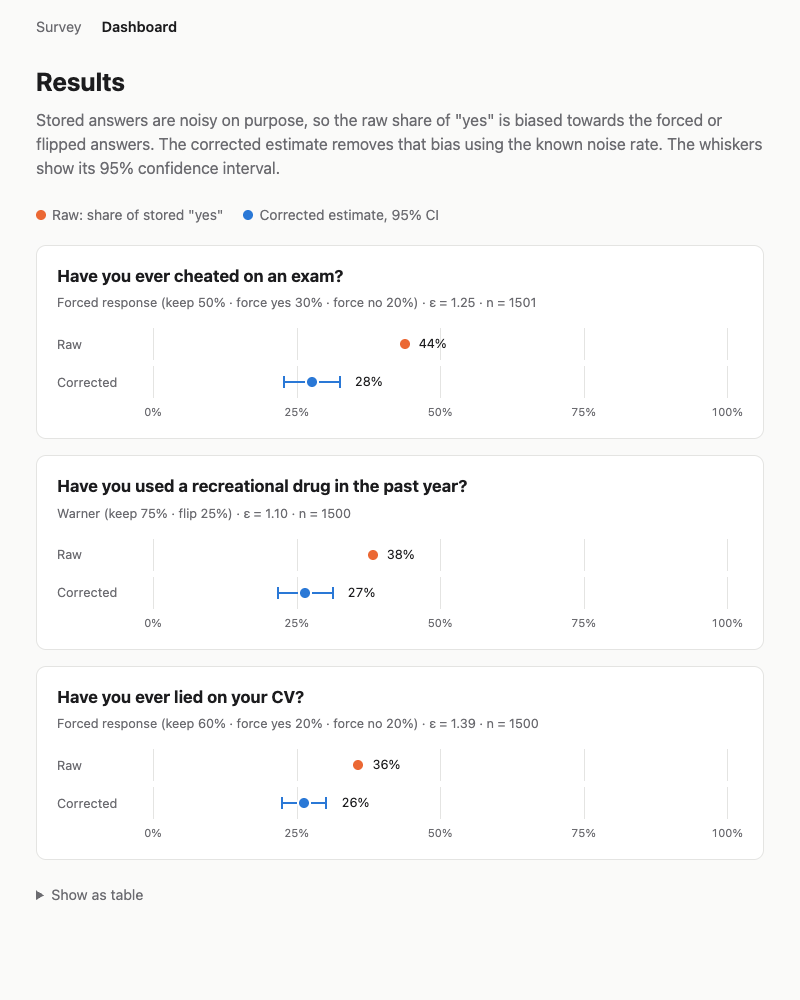

# Noisy Survey

[](https://github.com/Rishavbhattarai/noisy-survey/actions/workflows/test.yml)

An anonymous survey app with built-in noise, based on the idea behind *Safely Report*.

Sensitive yes/no answers are randomized **before** they are stored. For example, "yes" is recorded 30% of the time no matter what the person said. No stored answer can be traced back to anyone, yet the true percentage can still be recovered from the known noise rate. A dashboard shows the raw (noisy) results next to the corrected estimate and its 95% confidence interval.



*1,500 simulated respondents per question, true rate 25%. The raw share of "yes" is 36–44%; the corrected estimates are 26–28% and every interval contains 25%.*

## Run

```bash
python3 -m venv .venv && source .venv/bin/activate
pip install -r requirements.txt

python -m scripts.seed                                  # add sample questions
python -m scripts.simulate --n 1000 --true-rate 0.25    # optional: synthetic respondents
python -m app                                           # http://127.0.0.1:8000

pytest -q
```

`python -m app` starts uvicorn **with the access log off** (see [Privacy design](#privacy-design)). Set `RELOAD=1` for auto-reload, `PORT` to change the port, and `NOISY_SURVEY_DB` to use a different database file.

| Page | What it does |
|---|---|
| `/survey` | The questionnaire, with a note under each question explaining its noise |
| `/dashboard` | Raw vs corrected estimate per question, with a table view |
| `/api/results` | The same numbers as JSON |

## The math

Let $\pi$ be the true share of "yes" in the population, and $\hat\lambda$ the observed share of "yes" among the $n$ stored answers. Each question uses one of two randomized-response schemes.

**Forced response.** Each answer is kept with probability $p_{\text{truth}}$. Otherwise it is replaced with a forced "yes" (probability $p_{\text{yes}}$) or a forced "no" (probability $p_{\text{no}} = 1 - p_{\text{truth}} - p_{\text{yes}}$).

$$P(\text{stored yes}) = p_{\text{truth}}\,\pi + p_{\text{yes}} \quad\Rightarrow\quad \hat\pi = \frac{\hat\lambda - p_{\text{yes}}}{p_{\text{truth}}}$$

**Warner.** Each answer is kept with probability $p$ and flipped otherwise ($p \ne 0.5$).

$$P(\text{stored yes}) = p\,\pi + (1-p)(1-\pi) \quad\Rightarrow\quad \hat\pi = \frac{\hat\lambda - (1-p)}{2p - 1}$$

Both estimators are unbiased: they are a linear function of $\hat\lambda$, whose expectation is the stored-yes probability. Their standard error is the binomial one, scaled by the same factor:

$$\text{SE}_{\text{forced}} = \frac{1}{p_{\text{truth}}}\sqrt{\frac{\hat\lambda(1-\hat\lambda)}{n}} \qquad \text{SE}_{\text{Warner}} = \frac{1}{|2p-1|}\sqrt{\frac{\hat\lambda(1-\hat\lambda)}{n}}$$

The dashboard shows $\hat\pi \pm 1.96\,\text{SE}$, clipped to $[0, 1]$.

### The privacy guarantee (ε)

Each mechanism is **ε-locally differentially private**: whatever a person truly answered, any stored answer is at most $e^\varepsilon$ times more likely under one true answer than the other.

$$\varepsilon_{\text{forced}} = \max\left(\ln\frac{p_{\text{truth}} + p_{\text{yes}}}{p_{\text{yes}}},\ \ln\frac{p_{\text{truth}} + p_{\text{no}}}{p_{\text{no}}}\right) \qquad \varepsilon_{\text{Warner}} = \left|\ln\frac{p}{1-p}\right|$$

| Sample question | Noise | ε |
|---|---|---|
| Cheated on an exam? | forced: keep 50%, yes 30%, no 20% | 1.25 |
| Recreational drug use? | Warner: keep 75%, flip 25% | 1.10 |
| Lied on your CV? | forced: keep 60%, yes 20%, no 20% | 1.39 |

If $p_{\text{yes}}$ or $p_{\text{no}}$ is 0, ε is **infinite**. With no forced "no", for example, a stored "no" proves the true answer was "no". The dashboard shows this as "∞ (no guarantee)".

**The trade-off:** more noise gives a smaller ε but a wider interval. The SE grows like $1/p_{\text{truth}}$, so halving $p_{\text{truth}}$ needs about 4× as many respondents for the same precision.

## Privacy design

- **Randomize before storage.** `POST /survey` randomizes each answer on the server using `random.SystemRandom` (OS randomness, not predictable). The true answer only exists in that request's memory.
- **Store nothing identifying.** The `responses` table has exactly three columns: `id`, `question_id`, `reported_answer`. There is no timestamp, IP, user agent, cookie or session. A test (`test_responses_table_has_no_identifying_columns`) fails if anyone adds one.
- **No access log.** Uvicorn's default access log records each visitor's IP and request time, which could be matched to rows by insertion order. `python -m app` turns it off.
- **Tell respondents the rules.** Each question shows its real noise probabilities, so people can see how much deniability they get.

## Limitations

- **The true answer reaches the server.** It travels over HTTPS and is discarded after randomization, but you have to trust the server to do that. A stronger design randomizes in the browser so the true answer never leaves the device.
- **Answers from one submission are linkable.** Row ids follow insertion order, so one person's answers are consecutive across questions. Each answer is still noisy, but combining $k$ answers from one person weakens privacy: the ε values add up. Storing aggregate counters instead of rows, or shuffling inserts in batches, would fix this.
- **No duplicate protection.** Submissions are anonymous by design, so one person can submit many times.
- **Small samples.** The interval uses a normal approximation, which is unreliable for small $n$ or rates near 0 or 1.

## Project layout

```
app/
  privacy.py     randomization, estimators, ε: pure functions, no I/O
  db.py          SQLite schema and queries (only noisy answers stored)
  results.py     raw vs corrected result per question
  main.py        FastAPI routes: /survey, /dashboard, /api/results
  __main__.py    `python -m app`: uvicorn with the access log off
  templates/     Jinja2 pages (plain HTML/CSS, no JS framework)
scripts/
  seed.py        sample questions
  simulate.py    synthetic respondents with a known true rate
tests/           pytest: math simulations, schema, form, dashboard, simulator
```
